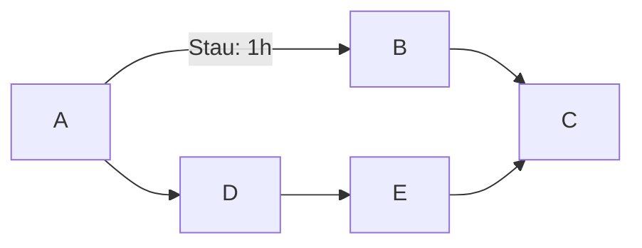

# Algorithmen - Pathfinding
Verschiedene algorithmen für wegfindung
<hr>

# Labyrinth aufbau
Das Labyrinth besteht nur aus ASCII zeichen:
```
Z = Ziel
. = 1 (Weg)
* = 2 (Steine)
% = 3 (Löcher im Boden)
& = 5 (Falle)
# = Wände
```
Die Start koordinate ist immer vorgegeben und es muss der ganze Rand umrandet sein mit Wänden

## Tiefensuche


Die Tiefensuche ist ein sehr simpler Algorithmus der immer in einer Richtung geht und bei Kreuzungen eine richtung Priorisiert!
Es funktioniert mit einen Stack (hier: Stapel), auf dem die nicht Besuchten und relevanten Nachbarn gemerkt werden.<br>
Der Algorithmus beginnt indem die Start position auf den Stapel gelegt wird und danach alle möglichen Nachbarn. Die Reihenfolge, wie die Nachbarn auf den Stapel gelegt werden, ist wichtig, weil immer die oberste Karte des Stapels die Priorisierte nächste Position ist.<br>
Wenn der Stapel leer ist ist kein Weg gefunden und es endet. Wenn nicht dann wird die oberste Position vom Stapel genommen, wenn sie noch nicht Besucht ist, weil dann nimmt man die nächste Position. Wenn diese Position, aber das Ziel ist endet es auch (, aber erfolgreich). <br>
Falls die Position noch nicht besucht war und auch nicht das Ziel war, werden alle relevanten Nachbarn auf den Stapel gelegt. Und es beginnt von neu. <br>

Startposition auf Stapel <br>
Stapel leer? -> Kein Weg gefunden, Ende <br>
Oberste Position vom Stapel nehmen<br>
Bereits besucht? -> zurück zu 2<br>
Ziel? -> Gefunden, Ende<br>
Alle unbesuchten Nachbarn auf Stapel -> zurück zu 2<br>

### [Programm](tiefensuche.py)

Es fängt, wie gesagt, an mit der Startposition und die Nachbarn auf den Stapel zu tun:<br>
``` python
# Das dritte Element ist die Richtung: 0 = rechts, 1 = oben, 2 = links, 3 = unten
stack.append((start, direction))  # Startposition zum Stapel hinzufügen

# Nachbarn auf den Stapel hinzufügen
abs_neighbor = [(x+1, y), (x, y-1), (x-1, y), (x, y+1)]
relative_neighbor = abs_neighbor[direction:] + abs_neighbor[:direction]
for (i, j) in relative_neighbor: # Alle Nachbarn
    if lab[j][i] != "#" and not (i, j) in known: # Ist der Nachbar relevant?
        new_direction = get_direction(start, (i, j))
        parent[(i, j)] = start
        stack.append(((i, j), new_direction)) # Relevante Nachbarn auf den Stapel tun
```
> [!NOTE]
> `abs_neighbor` sind die Nachbarn in absoluter  (d.h. Richtungen: westen/rechts, norden/oben, osten/links und süden/unten) die dann mit hilfe der `direction` Variable relativiert werden. So das in die Richtung die grade sich bewegt wurde geguckt wird.
> Um diese Richtung, in der, der Nachbar ist, zu bekommen, ist wird `get_direction` benutzt.

Es geht weiter mit einer Schleife (gleiche zu "Stapel leer?"), die While-schleife endet erst wenn der Stapel leer ist.
Als nächstes wird die Oberste position genommen vom Stapel:
``` python
current_pos, direction = stack.pop()  # Aktuelle Position vom Stapel nehmen (letztes Element)
x, y = current_pos
```
Danach wird überprüft ob, die aktuelle Position schon besucht ist (eigentlich unnötig, weil schon bekannte Position nicht auf den Stapel gelegt werden).
``` python
if current_pos in known: # Besucht?
    continue  # Wenn die Position bereits besucht wurde, überspringen
```
Ist die aktuelle Position das Ziel?
``` python
if lab[y][x] == "Z": # Ziel?
    print("Ziel gefunden:", current_pos)  # Ziel gefunden
    break  # Schleife verlassen
```
Dann werden wieder alle relevanten Nachbarn auf den Stapel gelegt:
``` python
abs_neighbor = [(x+1, y), (x, y-1), (x-1, y), (x, y+1)]
    relative_neighbor = abs_neighbor[direction:] + abs_neighbor[:direction]
    for (i, j) in relative_neighbor: # Alle Nachbarn
        if lab[j][i] != "#" and (i, j) not in known: # Ist der Nachbar relevant?
            new_direction = get_direction(current_pos, (i, j))
            parent[(i, j)] = current_pos
            stack.append(((i, j), new_direction)) # Relevante Nachbarn auf den Stapel tun
```

> [!IMPORTANT]
> Ein Nachbar ist relevant, wenn er nicht eine Wand ist (```!= "#" ```) und noch nicht Bekannt ist (```(i, j) not in known```)

## Breitensuche

Die Breitensuche ist sehr ähnlich zu der Tiefensuche nur hier ist es kein Stapel, sondern eine Warteschlange. Es wird immer die unterste Karte vom Stapel genommen (bildlich erklärt).

Startposition auf hinten an die Warteschlange <br>
Stapel leer? -> Kein Weg gefunden, Ende <br>
Nächste Position von der Warteschlange nehmen<br>
Bereits besucht? -> zurück zu 2<br>
Ziel? -> Gefunden, Ende<br>
Alle unbesuchten Nachbarn hinten an die Warteschlange -> zurück zu 2<br>

### [Programm](breitensuche.py)

Das Breitensuche programm ändert sich, im gegensatz zum Tiefensuche programm, hauptsächlich bei der Warteschlange.<br>
Anstatt ```current_pos = stack.pop() # oberste position``` ist es ```current_pos = queue.pop(0)  # unterste postion```
> Die relativen Richtungen wurden entfernt, da sie nun irrelevant sind.

## Dijkstra

Der Dijkstra-Algorithmus funktioniert im Prinzip wie die Breitensuche, jedoch haben Positionen unterschiedliche Gewichte. Der Unterschied zur Breitensuche besteht darin, dass der Weg zu verschiedenen Positionen unterschiedlich lang sein kann.<br>


     
Also Beispiel wir wollen von Stadt A nach Stadt C und von A nach B ist Stau also dauert das Länger.<br> Der Breitensuche ist das Egal das ist der direkte Weg ist. Dijkstra würde den Stau umgehen und so einen kürzeren Weg finden.
>  D.h. bei der Breitensuche ist die Länge von A zu B nach C egal, weil es der direkte Weg wäre, aber Dijkstra sieht das der Weg von A zu B 1h dauert und der Weg von A zu D nach E zu C kürzer ist.<br>

Das Funktioniert indem die Warteschlange sortiert wird. Nach Kosten/Zeit/Gewicht. 

### [Programm](dijkstra.py)
Bei Dijkstra sind die Kosten bis zur aktuellen Position wichtig, weshalb diese nun ebenfalls in der Queue gespeichert werden:
``` python
queue: list[tuple[int, tuple]] = [(0, start)]
```
Deshalb wird immer, wenn die Nachbarn auf den Stapel gelegt werden, noch die Kosten der Aktuellen position mit dem Kosten des Nachbars addiert und dazu gelegt:
``` python
def add_neighbors(cost: int, pos: tuple[int]) -> None:
    # Nachbarn auf den Stapel hinzufügen
    global queue
    x, y = pos
    neighbor = [(x+1, y), (x, y-1), (x-1, y), (x, y+1)] 

    for (i, j) in neighbor: # Alle Nachbarn
        if lab[j][i] != "#" and not (i, j) in known: # Ist der Nachbar relevant?
            if (i, j) not in parent: # Keine doppelt hinzufuegen fuer den resultierenden Weg
                parent[(i, j)] = pos
            queue.append((cost + weight[lab[j][i]], (i, j))) # Relevante Nachbarn auf den Stapel tun
```

Die Warteschlange wird sortiert mit;
``` python
queue.sort(key=lambda n: n[0])`
```
> [!NOTE]
> `lambda` ist eine im prinzip eine Funktion d.h. man hätte so es auch so machen können:
> ``` python
> def get_cost(n):
>     return n[0]
> 
> queue.sort(key=get_cost)
> ```

<hr>

## Genutzte module
Für den Dijkstra Algorithmus musste ich ```import heapq``` benutzten, weil es sonst zu lange dauert. Dazu habe ich meine eigenen Module benutzt ``vis`` und `labyrinth`. [Vis](vis.py) ist zum Visualisieren des resultierenden Weges und das [Labyrinth](labyrinth.py) Modul ist für die verschiedenen test Labyrinthe.<br>
